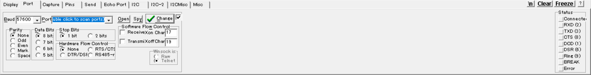

## Data Send and Receive 
ตัวอย่างที่เเอปควรจะมี จาก realterm ในการสื่อสารเเบบ I2C

ผมควรมี parity  bit เวลาส่งเพื่อเอาไว้เชค error
stop bit 
Flow control
https://www.nextpcb.com/blog/spi-i2c-uart

## Graph Display

## WIFI connection

## MQTT connection

## UI
ควรหา library ที่มี css ที่ทําให้งานดูสวยขึ้น เเละไม่ขัดกับการใช้งาน