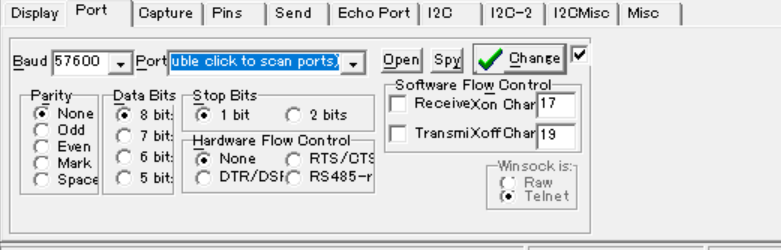
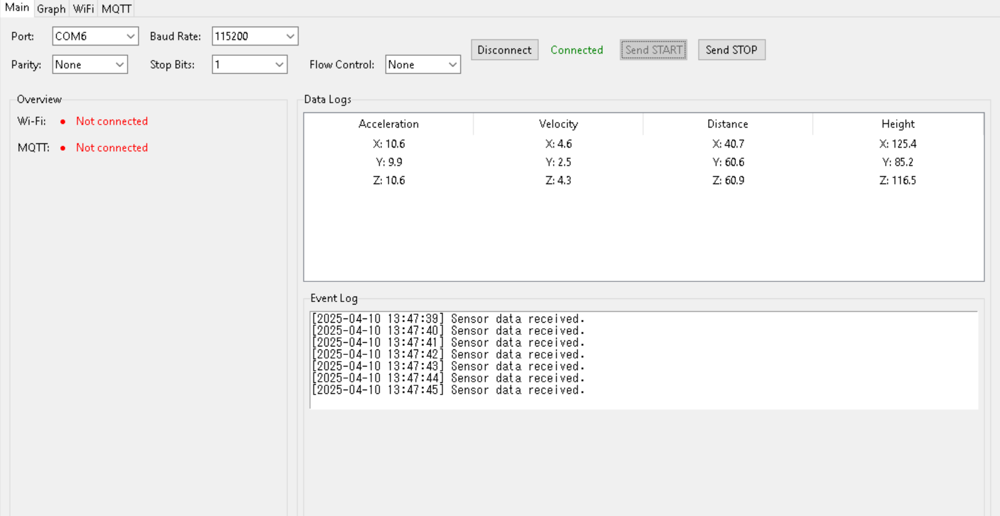
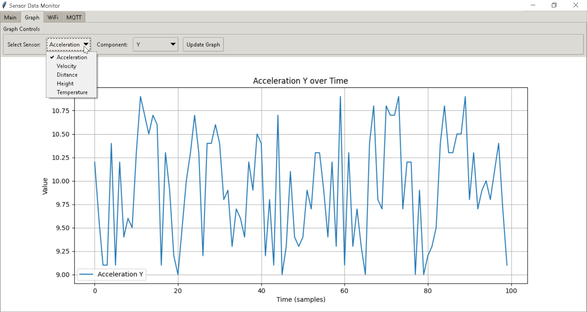
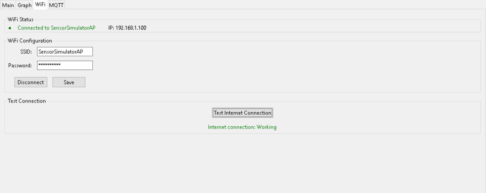
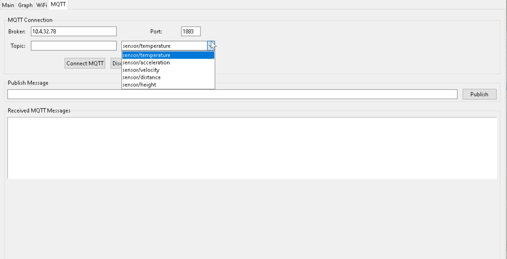
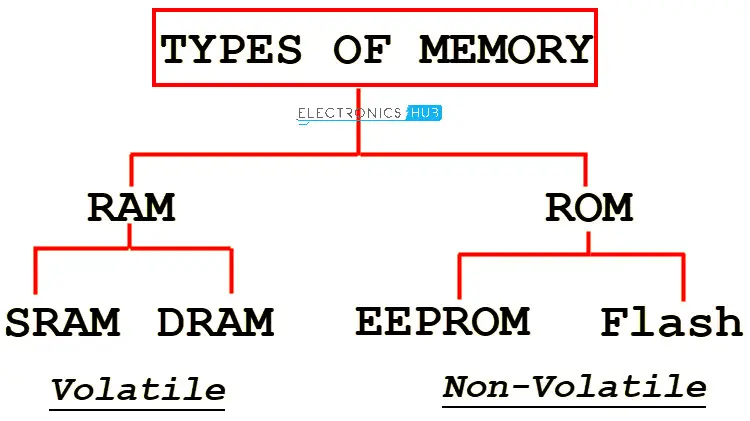
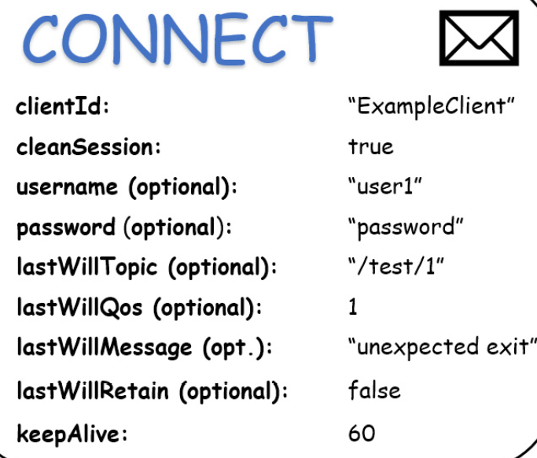

## สัปดาห์ที่ 1: Data Transfer and Receive + UI พื้นฐาน

- **โครงสร้างโปรแกรมและการส่ง/รับข้อมูล**  
  - วางโครงสร้างโปรแกรมหลัก (Code architecture) สำหรับการสื่อสารผ่าน Serial (I2C) โดยใช้คำสั่งเช่น START_READING และ STOP_READING  
  - กำหนดค่าพารามิเตอร์ในการสื่อสาร:  
    - **Parity Bit** เพื่อเช็ค error  
    - **Stop Bit**  
    - **Flow Control**  
  - ทดสอบรับส่งข้อมูลโดยแสดงตัวอย่างข้อมูลจาก Realterm เพื่อให้แน่ใจว่าสามารถแยกแยะข้อมูล JSON กับข้อความอื่น ๆ ได้  
  - สามารถจับ JSON object ได้ครบถ้วน (โดยอาจแยกโหมด sensor data กับ command อื่นๆ)

- **การแสดงผลกราฟ (Graph Display) และ Time Scale**  
  - ออกแบบ UI พื้นฐานในหน้าหลัก (Main tab) ที่มีพื้นที่สำหรับแสดงข้อมูล (Overview, Data Log)
  - พัฒนาโครงสร้างสำหรับส่วนของกราฟใน Graph tab รวมทั้งพิจารณาเพิ่มตัวเลือก Time Scale (ถ้ามีความจำเป็น)
  - ทดสอบการสะสมและเก็บข้อมูลสำหรับการวาดกราฟ

- **ปรับ UI เบื้องต้น**  
  - ใช้ Tkinter และ ttk ในการจัดวางหน้าต่าง (layout) และ widget ต่าง ๆ ให้เหมาะสมกับการนำเสนอข้อมูล
  - เขียนการบันทึก log เหตุการณ์ผ่าน Text widget (Event Log)

#### สิ่งที่คาดหวังจะมีลักษณะคล้ายๆ Application ของ Realterm

 
\pagebreak 

### Basic Layout

 
\pagebreak 

## สัปดาห์ที่ 2: ทดสอบและพัฒนาระบบ WiFi และ MQTT

- **Credential ข้อมูลสําคัญ**
    - ใช้ Library Preferences เเทนการใช้ EEPROM ซึ่งเป็นการใช้ Flash Memory ที่เราต้องการข้อมูลถาวรเก็บไว้อย่างถาวร โดยไม่สูญหายจากการ Disconnect หรือ การ Reboot 
    - Preference จะมีการสนับสนุนเเละการพัฒนาจาก Developer เยอะกว่า EEPROM เลยเลือกใช้

- **Multitasking**
    - ใช้ FREERTOS ในการจัดการกับงานที่ต้องทํางานพร้อมกันอย่าง MQTT เเละการรับ Sensor โดยจะสั่งผ่านคนละ Function กันเเทนการเขียนใน For loop() อย่างเดียว

- **ระบบ WiFi Connection**  
  - แก้ปัญหาการ Interrupt ของ Serial command โดยแยกโหมดการตั้งค่า WiFi (WiFi Setup Mode) ออกมาให้ชัดเจน  
  - พัฒนาการส่งคำสั่ง `SET_WIFI` ไปยัง ESP32 และทดสอบการเชื่อมต่อ WiFi ว่า Username/Password ที่ส่งไปนั้นตรงกับที่เก็บไว้ใน firmware หรือ Preferences   
  - เพิ่มฟีเจอร์สำหรับการออกจากโหมด WiFi setup (เช่น ให้แสดงปุ่มยืนยันการออกจากโหมดพร้อมสัญญาณ LED บน ESP32)

- **ระบบ MQTT Connection** 

 
  - พัฒนาระบบ MQTT tab ให้มีฟิลด์สำหรับการตั้งค่า Broker, Port และ Topic  
  - ให้ผู้ใช้สามารถเลือก Topic ได้จาก dropdown (อย่างน้อย 3 Topic เช่น sensor/temperature, sensor/acceleration, sensor/velocity)
  - ทดสอบการเชื่อมต่อ MQTT ในพื้นฐานด้วยการ publish/subscribe  
  - เสริมการส่งข้อมูล MQTT (รวมทั้งการใส่ password หากมีและการรับ feedback จาก MQTT broker)

- **ปรับปรุง Event Handling**  
  - ทดสอบการรับข้อมูลจาก sensor ผ่าน Serial ร่วมกับการสั่งงานด้าน WiFi/MQTT เพื่อให้แน่ใจว่าไม่เกิดการชนกันของ command
  - สร้างระบบ log ที่ชัดเจนเพื่อแยกแยะข้อมูล Sensor data กับข้อความ command ต่างๆ

 
\pagebreak 

## สัปดาห์ที่ 3: Bug Fixes, Safety, และ Modernize UI

- **แก้ไขข้อผิดพลาดและเพิ่มความปลอดภัย**  
  - ตรวจสอบและแก้ไขปัญหาการ delay ของข้อมูล Sensor ที่เกิดจากปัญหาการ parse JSON (อาจใช้ flag สำหรับหยุดส่งข้อมูล sensor ในขณะส่ง command)
  - ปรับปรุงการจัดการ buffer ในการอ่านข้อมูลจาก Serial ให้มีประสิทธิภาพมากขึ้น
  - เพิ่ม error handling และ log เพื่อตรวจสอบสถานะการเชื่อมต่อ WiFi/MQTT

- **ปรับปรุงและทำให้ UI ดูทันสมัย**  
  - พิจารณาใช้ ttk style ที่ custom ได้มากขึ้น ซึ่งจะมี CustomTkinter (Library ที่ใหม่ดูดีกว่าเเต่ จะขาดบางฟังช์ชั่นที่เราต้องการใช้ )
  - ลองเขียนใน PyQT6 หรือ ใช้ Electron Framework เขียน Javascript เเทน

- **ทดสอบระบบทั้งหมด**  
  - ทดสอบการทำงานร่วมกันของทุกส่วน: Data Transfer, Graph Display, WiFi Connection และ MQTT Connection
  - ตรวจสอบความปลอดภัย เช่น การตรวจสอบ Error จาก parity bit, stop bit ฯลฯ  
  - รายงาน bug ต่างๆที่พบเจอ เเละเพิ่ม Security ในเเอปอย่างการป้องกันการ Overflow ของข้อมูลที่ขนาดใหญ่, การ Login ที่เยอะเกิน

 
\pagebreak 

| Date          | Task                                             |
|---------------|--------------------------------------------------|
| **Week 1**    | **Data Transfer and Receive**                    |
| Mon, Week 1   | Setup Project Structure & Basic Serial Communication |
| Tue, Week 1   | Implement Parity Bit, Stop Bit, Flow Control     |
| Wed, Week 1   | Serial Command Parsing & Basic Layout            |
| Thu, Week 1   | Graph UI Design & Basic Plotting from Matplotlib |
| Fri, Week 1   | Add Time Scale to Graph Display                  |
| Sat, Week 1   | Better Data parsing with Test command and Receiving |
| **Week 2**    | **MQTT and WiFi Testing**                        |
| Mon, Week 2   | Separate WiFi Setup Mode & LED indication        |
| Tue, Week 2   | Test WiFi Credentials & Connection               |
| Wed, Week 2   | Fix Serial Command Conflicts & Stability         |
| Thu, Week 2   | MQTT Connection & Authentication Setup           |
| Fri, Week 2   | MQTT Multiple Topics & Dynamic Topic Selection   |
| Sat, Week 2   | Test MQTT Publish and Subscribe                  |
| **Week 3**    | **Bug Fixes, Safety, UI Modernization**          |
| Mon, Week 3   | Bug Fix: JSON Parsing Efficiency                 |
| Tue, Week 3   | Bug Fix: Sensor Data Delay & Serial Reliability  |
| Wed, Week 3   | Error Handling & Safety Checks                   |
| Thu, Week 3   | UI Enhancement (Responsive Design & Styling)     |
| Fri, Week 3   | Final System Integration Testing                 |
| Sat, Week 3   | Documentation & User Manual                      |

## Reference
https://www.nextpcb.com/blog/spi-i2c-uart

https://www.hivemq.com/mqtt/mqtt-5/

