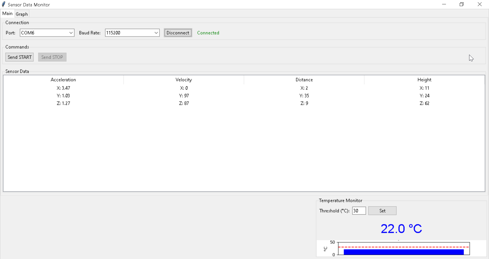
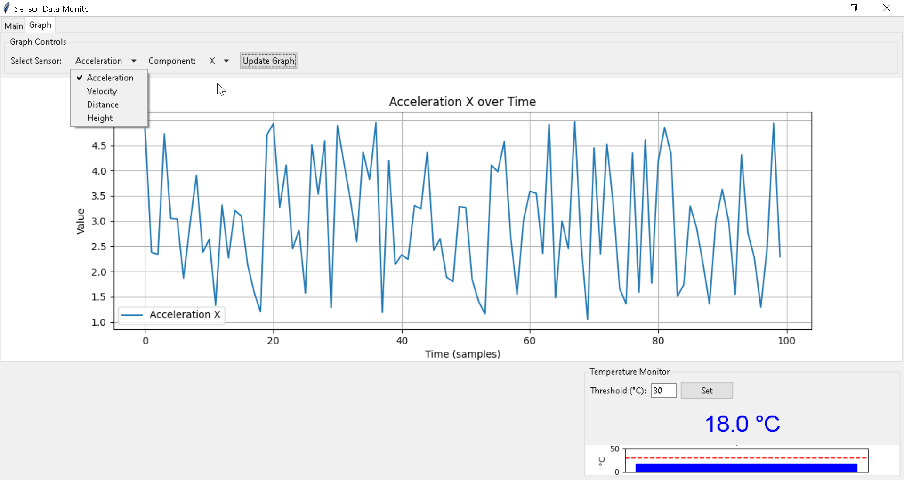

# First week

- Testing Data send and recieve
- Testing Simple GUI 
- Selective Drop down menu for baud rate and COM PORT
- Command for START and STOP sensor reading
- Real time temperature monitoring with threshold warning popup
-  Sensor reading log display for a,v,d,h

- Graphical Display for a,v,d,h respective to each axis x,y,z. Update graph to fetch the lastest data plot vs time

### NEEDS
- Sensor reading log **Must take less space** we should add more space for log event 
- LOG for event not just the sensor log
    - Sensor read Sensor stop event
- If the Scale isn't too big we can put 3 axis display in one screen

### ERROR
- When Disconnect Send Start and Stop latch themselves, appear grey cannot select another option for example when we select start Disconnect When cannot choose Send Stop but the other functions work the same